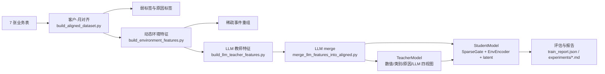

# 电费异常原因分析与教师-学生蒸馏项目整理版

## 1. 项目概述

本项目面向“客户-月”粒度的电费异常分析：输入多张电力业务表，输出异常风险、原因概率和可解释提示，并通过教师-学生蒸馏把训练侧的大模型/规则/环境知识压缩到可部署的小模型中。

当前工作不只是传统账单规则识别，而是围绕一个研究问题展开：

> 当线上不能逐条调用大模型、实体行为稀疏、且测试样本存在时间外推/冷启动/跨行业偏移时，如何在判别式时间序列任务上同时完成异常判别与原因解释。

现有实验台为 120000 行客户-月样本，覆盖约 10000 个客户、12 个统计月。样本包含客户画像、电表信息、抄表、电量、电费、电价、异常事件等来源，并构造弱标签、原因多标签、动态环境特征、稀疏事件特征和 LLM 教师特征。

核心路线：

1. 多表对齐：把 7 张业务表汇总为客户-月建模样本。
2. 动态环境建模：自身漂移、同群基线、电价/季节上下文。
3. 稀疏事件重组：把费用突增、抄表异常、示数突增、读数不匹配等整理为事件视图。
4. LLM 教师：将环境与事件编译成 E2P 风格 prefix，离线获得异常概率、原因概率、prefix 向量和短解释。
5. 教师-学生蒸馏：教师使用多视图融合，学生使用轻量 MLP + 环境分支 + latent 容器 + prefix 对齐。
6. HORIZON 风格评估：覆盖 temporal、cold_start、cross_domain_industry、cross_domain_voltage、tariff_shift 等切分。

## 2. 系统架构

整体架构可以分为数据层、特征层、教师层、学生层、评估层五部分。




### 2.1 数据与标签层

实现文件：`code/build_aligned_dataset.py`

主粒度为 `客户ID + month`。脚本读取以下业务表：

- `客户档案表.csv`
- `电表档案表.csv`
- `抄表数据表.csv`
- `客户用电量表.csv`
- `客户电费结果表.csv`
- `异常结果表.csv`
- `电价表.csv`

输出客户-月对齐表，并构造：

- 弱标签 `weak_label`：由异常事件、抄表异常、费用突增等信号组合而成。
- 原因标签 `label_reason_*`：由规则命中和费用突增等原因构造。
- 关键派生列：`fee_mom_ratio`、`energy_mom_ratio`、`unit_price_est`、`expected_unit_price`、`unit_price_dev`、`fee_log1p`、`energy_log1p` 等。

### 2.2 环境与稀疏事件层

实现文件：`code/build_environment_features.py`

环境特征分为四组：

- `env_self_*`：客户自身历史滑窗特征，使用 `groupby("客户ID").shift(1)` 防止当前月泄漏。
- `env_peer_*`：上一月同群基线，按客户类型、电压等级、行业编码等分组，带小群体 fallback。
- `env_tariff_*`：电价与费率环境，包括费率变化标记、基准费率、附加费率、期望单价。
- `env_season_*`：月份正余弦季节编码。

稀疏事件列包括：

- `event_fee_spike`
- `event_meter_increase`
- `event_reading_mismatch`
- `event_read_abn`
- `event_unit_price_dev_high`
- `event_energy_spike`
- `event_count`
- `event_severity`
- `event_dominant_type`
- `sparse_event_vec`

### 2.3 LLM 教师特征层

实现文件：`code/build_llm_teacher_features.py`

LLM prompt 采用三段式：

- `[ENVIRONMENT]`：客户画像、电价、同群基线、自身历史、季节等。
- `[SPARSE_EVENTS]`：稀疏事件、事件强度、费用环比、同群偏离等。
- `[TASK]`：要求模型输出严格 JSON，包括异常概率、原因概率、prefix 向量、短解释。

输出列：

- `llm_anomaly_prob`
- `llm_reason_prob_*`
- `llm_prefix_emb_*`
- `llm_explanation`

真实 API 的 2500 条 pilot 已完成，并与无泄漏 mock 做过对比。OpenAI/GLM 兼容接口在 2500 子集上表现为：

- `llm_anomaly_prob` 相对 `weak_label` 的 AUROC：mock 0.693，OpenAI 0.795。
- AUPRC：mock 0.213，OpenAI 0.243。
- ECE：mock 0.366，OpenAI 0.329。
- prefix 几何与 mock 基本不在同一空间，真实 prefix 更适合作为阶段 6 的对齐目标。

## 3. 项目结构

```text
.
├── README.md
├── run_monitor.sh
├── code/
│   ├── build_aligned_dataset.py
│   ├── build_environment_features.py
│   ├── build_llm_teacher_features.py
│   ├── merge_llm_features_into_aligned.py
│   ├── models.py
│   ├── train_distill.py
│   ├── calibration.py
│   ├── evaluate_stage2_gate.py
│   ├── run_horizon_eval.py
│   ├── compare_phase5_mock_vs_openai.py
│   ├── analyze_phase5_pilot.py
├── data/
│   └── aligned/
│       ├── aligned_customer_month*.csv
│       ├── aligned_customer_month*_metadata.json
│       └── aligned_customer_month_llm_features*.csv
├── checkpoints/
│   ├── baseline_v0/
│   ├── env_self_v1/
│   ├── env_full_v1/
│   ├── env_stage3_v1/
│   ├── horizon_stage5_openai_p2500/
│   └── horizon_stage6_openai_p2500/
├── experiments/
│   ├── results.md
│   ├── horizon_eval*.md
│   ├── phase5_*.md/json/csv
│   ├── phase6_openai2500_train_acceptance.md
│   ├── group_meeting_phase6_slides.md
```

## 4. 输入说明

### 4.1 原始输入

原始业务表应放在：

```text
data/input_output_tables/
```

预期包含 7 张 CSV：

```text
客户档案表.csv
电表档案表.csv
抄表数据表.csv
客户用电量表.csv
客户电费结果表.csv
异常结果表.csv
电价表.csv
```

脚本会自动尝试 `utf-8-sig / utf-8 / gbk / gb18030` 编码。

### 4.2 建模输入

当前仓库已有多版对齐产物，常用输入如下：


| 文件                                                                                           | 用途                        |
| -------------------------------------------------------------------------------------------- | ------------------------- |
| `data/aligned/aligned_customer_month.csv`                                                    | 原始客户-月对齐表                 |
| `data/aligned/aligned_customer_month_decoupled.csv`                                          | 标签/规则解耦扰动后的对齐表            |
| `data/aligned/aligned_customer_month_decoupled_env_full_d3c.csv`                             | 防泄漏 D3-C 环境与事件特征表         |
| `data/aligned/aligned_customer_month_decoupled_env_full_d3c_merged_llm_openai_pilot2500.csv` | 合并 2500 条真实 LLM 特征后的全量训练表 |


### 4.3 LLM 输入

LLM 教师构建时读取客户-月表中的环境列与事件列，生成 prompt 后调用 provider：

- `mock`：本地启发式 mock，用于链路测试。
- `openai`：OpenAI 兼容接口，本仓库实际 pilot 使用 GLM-5.1 兼容协议。

注意：LLM 特征合并后训练时不要再传 `--llm_features_csv`，避免重复 merge。

## 5. 输出说明

### 5.1 数据输出


| 输出                                                      | 说明               |
| ------------------------------------------------------- | ---------------- |
| `data/aligned/aligned_customer_month.csv`               | 客户-月主样本          |
| `data/aligned/*_metadata.json`                          | 数据血缘、行数、特征组、构建参数 |
| `data/aligned/aligned_customer_month_llm_features*.csv` | LLM 教师特征         |
| `data/aligned/*_merged_llm*.csv`                        | 合并 LLM 特征后的训练表   |


### 5.2 训练输出

每次训练输出目录通常位于 `checkpoints/<run_name>/`：


| 文件                    | 说明                |
| --------------------- | ----------------- |
| `teacher.pt`          | 教师模型权重            |
| `student.pt`          | 学生模型权重            |
| `train_report.json`   | 训练配置、切分信息、教师/学生指标 |
| `metrics.jsonl`       | epoch 级训练和验证日志    |
| `training_curves.png` | 训练曲线              |
| `tb_logs/`            | TensorBoard 日志    |


## 6. 推理流程

当前仓库主要完成训练与评估闭环，线上推理可以按如下流程整理：

1. 输入某个客户在某月的业务记录。
2. 复用 `build_aligned_dataset.py` 的字段对齐逻辑，形成客户-月样本。
3. 复用 `build_environment_features.py` 的历史滑窗、上一月同群基线、电价/季节特征。
4. 构造稀疏事件列。
5. 使用学生模型 `student.pt` 做低延迟推理。
6. 输出：
  - 异常分数；
  - Top 原因概率；
  - 关键证据字段，如费用环比、同群偏离、单价偏差、自身历史偏离、抄表异常等。

训练阶段可以调用 LLM，推理阶段默认不调用 LLM。LLM 的作用被离线蒸馏到教师视图、学生 latent 和 prefix 对齐目标中。

## 7. 模型与训练

### 7.1 教师模型

实现文件：`code/models.py`

`TeacherModel` 是规则增强的多视图融合网络：

- 数值视图：月级统计、环境特征、派生特征。
- 类别视图：客户类型、电压等级、行业编码、费率类型等。
- 原因视图：`reason_rule_*` 与 `event_*`。
- LLM 视图：`llm_prefix_emb_*` 或兼容的 `llm_risk_emb_*`。

结构：

1. 每个视图独立编码为 hidden 表征。
2. 使用 softmax gate 做多视图融合。
3. 输出异常 logit 与原因多标签 logit。

教师目标：在训练侧吃满规则、环境、类别和 LLM 信号，作为学生的蒸馏上界。

### 7.2 学生模型

实现文件：`code/models.py`

`StudentModel` 是面向部署的小模型，当前阶段包括：

- `SparseGate`：输入特征软选择。
- 主数值 MLP：处理非环境数值。
- `EnvironmentEncoder`：单独处理 `env_self_* / env_peer_* / env_tariff_* / env_season_*`。
- latent 容器：`mu_head / logvar_head`，通过重参数化得到 `z`。
- `prefix_proj(z)`：将学生 latent 对齐到 LLM prefix 空间。
- 异常头、原因头、教师表征对齐头。

阶段 6 关键配置：

```text
use_env_view = true
env_dim = 53
student_num_dim = 42
teacher_num_dim = 95
student_latent_dim = 32
student_alpha_kl = 0.01
student_alpha_prefix = 0.5
student_prefix_dim = 16
```

### 7.3 损失函数

学生总损失：

```text
L_total =
  alpha_sup    * L_sup
+ alpha_prob   * L_prob
+ alpha_reason * L_reason
+ alpha_repr   * L_repr
+ alpha_kl     * L_kl
+ alpha_prefix * L_prefix
+ lambda_sparse * L_sparse
```

其中：

- `L_sup`：弱标签 BCE。
- `L_prob`：异常概率蒸馏。
- `L_reason`：原因分布蒸馏 + 原因弱标签监督。
- `L_repr`：学生表征对齐教师融合表征。
- `L_kl`：学生 latent 的 KL 正则。
- `L_prefix`：学生 `prefix_proj(z)` 与真实 LLM prefix 的掩码 MSE/cosine 对齐。
- `L_sparse`：SparseGate 稀疏正则。

### 7.4 已有实验结果摘要

#### Stage 1-3：环境与事件特征

在原始非解耦管线中：


| 阶段                      | 学生 F1 变化             | 学生 Recall 变化         | 结论                      |
| ----------------------- | -------------------- | -------------------- | ----------------------- |
| Stage 1 `env_self_v1`   | 0.890027 -> 0.891834 | 0.803591 -> 0.805223 | 自身漂移小幅增益                |
| Stage 2 `env_full_v1`   | 0.891834 -> 0.893501 | 0.805223 -> 0.807943 | 同群/电价继续小幅提升             |
| Stage 3 `env_stage3_v1` | 0.893501 -> 0.927028 | -                    | 稀疏事件显著提升，但暴露潜在 shortcut |


解耦与 D1 屏蔽后：

- 阶段 2 早期 full 相对 self 的大幅提升被证实有泄漏虚高。
- D1 后 `decoupled_env_full_v1_d1` 相对 `decoupled_env_self_v1_d1` 基本打平或略降。
- 结论：当前合成数据下，单靠 peer/tariff 给学生带来的边际收益有限；需要通过教师 prefix、环境分支和 latent 对齐增强跨域鲁棒性。

#### HORIZON 评估

D1/D3-C rerun 的代表结果：


| mode                  | teacher_f1 | student_f1 | student_auprc | 说明               |
| --------------------- | ---------- | ---------- | ------------- | ---------------- |
| temporal              | 0.9797     | 0.8518     | 0.8463        | 时间外推基本盘          |
| cold_start            | 0.9753     | 0.8484     | 0.8648        | 未见客户             |
| cross_domain_industry | 0.9692     | 0.4266     | 0.4161        | 最能暴露学生跨域短板       |
| cross_domain_voltage  | 0.4088     | 0.1681     | 0.9516        | 当前切分指标形态异常，需谨慎解释 |
| tariff_shift          | 0.9387     | 0.0188     | 0.2272        | 费率漂移极难           |


#### Stage 5：真实 LLM 2500 merge

对比全表 mock LLM 基线，OpenAI 2500 merge 后：


| 切分                    | 学生基线 F1 | OpenAI2500 F1 | 结论     |
| --------------------- | ------- | ------------- | ------ |
| temporal              | 0.8507  | 0.8511        | 基本持平   |
| cold_start            | 0.8477  | 0.8500        | 略升     |
| cross_domain_industry | 0.4077  | 0.4293        | 跨域学生提升 |


#### Stage 6：Env Encoder + latent KL + prefix 对齐

与 Stage 5 学生相比：


| 切分                    | Stage 5 F1 | Stage 6 F1 | AUPRC 变化         |
| --------------------- | ---------- | ---------- | ---------------- |
| temporal              | 0.8511     | 0.8508     | 0.8459 -> 0.8457 |
| cold_start            | 0.8500     | 0.8531     | 0.8644 -> 0.8654 |
| cross_domain_industry | 0.4293     | 0.5158     | 0.4109 -> 0.5754 |


核心结论：阶段 6 在 temporal 上不退化，在 cold_start 上小幅提升，在最困难的 cross_domain_industry 上显著提升，说明环境分支、latent 容器和 prefix 对齐对跨域鲁棒性有实际价值。

## 8. 环境配置

项目默认使用本地 `.venv`：

```bash
.venv/bin/python --version
```

常用依赖包括：

- `numpy`
- `pandas`
- `torch`
- `matplotlib`
- `tqdm`
- `tensorboard` 或 `torch.utils.tensorboard`

真实 LLM 调用需配置环境变量，推荐通过：

```bash
source scripts/load_env.sh
```

训练监控：

```bash
bash run_monitor.sh --output-dir checkpoints/env_self_v1
```

TensorBoard：

```bash
.venv/bin/tensorboard --logdir checkpoints/env_self_v1/tb_logs --port 6006
```

## 9. 快速开始

### 9.1 构建客户-月对齐表

```bash
.venv/bin/python code/build_aligned_dataset.py \
  --input_dir data/input_output_tables \
  --output_csv data/aligned/aligned_customer_month.csv \
  --output_meta data/aligned/aligned_metadata.json
```

### 9.2 构建环境与事件特征

只构建 Stage 1 自身漂移：

```bash
.venv/bin/python code/build_environment_features.py \
  --input_csv data/aligned/aligned_customer_month_decoupled.csv \
  --output_csv data/aligned/aligned_customer_month_decoupled_env.csv \
  --output_meta data/aligned/aligned_customer_month_decoupled_env_metadata.json \
  --feature_scope stage1_self
```

构建 full 环境 + 稀疏事件：

```bash
.venv/bin/python code/build_environment_features.py \
  --input_csv data/aligned/aligned_customer_month_decoupled.csv \
  --output_csv data/aligned/aligned_customer_month_decoupled_env_full_d3c.csv \
  --output_meta data/aligned/aligned_customer_month_decoupled_env_full_d3c_metadata.json \
  --feature_scope full
```

### 9.3 构建 LLM 教师特征

mock 链路：

```bash
.venv/bin/python code/build_llm_teacher_features.py \
  --input_csv data/aligned/aligned_customer_month_decoupled_env_full_d3c.csv \
  --output_csv data/aligned/aligned_customer_month_llm_features_mock.csv \
  --provider mock \
  --prompt_version v3_e2p_natural
```

真实 OpenAI 兼容接口：

```bash
source scripts/load_env.sh

.venv/bin/python code/build_llm_teacher_features.py \
  --input_csv data/aligned/aligned_customer_month_decoupled_env_full_d3c.csv \
  --output_csv data/aligned/aligned_customer_month_llm_features_openai.csv \
  --provider openai \
  --prompt_version v3_e2p_natural \
  --limit_rows 2500 \
  --concurrency 8
```

### 9.4 合并 LLM 特征

```bash
.venv/bin/python code/merge_llm_features_into_aligned.py \
  --aligned_csv data/aligned/aligned_customer_month_decoupled_env_full_d3c.csv \
  --llm_features_csv data/aligned/aligned_customer_month_llm_features_openai.csv \
  --output_csv data/aligned/aligned_customer_month_decoupled_env_full_d3c_merged_llm_openai.csv
```

### 9.5 训练 Stage 6 学生

```bash
PYTHONPATH=code .venv/bin/python code/train_distill.py \
  --aligned_csv data/aligned/aligned_customer_month_decoupled_env_full_d3c_merged_llm_openai_pilot2500.csv \
  --output_dir checkpoints/horizon_stage6_openai_p2500/horizon_temporal \
  --split_mode temporal \
  --teacher_epochs 12 \
  --student_epochs 16 \
  --use_env_view \
  --student_latent_dim 32 \
  --student_alpha_kl 0.01 \
  --student_alpha_prefix 0.5 \
  --seed 42
```

### 9.6 HORIZON 评估

```bash
PYTHONPATH=code .venv/bin/python code/run_horizon_eval.py \
  --aligned_csv data/aligned/aligned_customer_month_decoupled_env_full_d3c_merged_llm_openai_pilot2500.csv \
  --output_root checkpoints/horizon_stage6_openai_p2500 \
  --split_modes temporal,cold_start,cross_domain_industry \
  --seed 42
```

